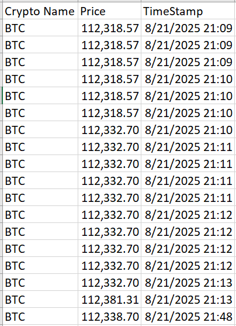

# Automated Crypto Web Scraper  

 
 
 
  

This project is a **Python-based automated web scraper** that collects real-time Bitcoin prices from [CoinMarketCap](https://coinmarketcap.com/) and stores them in a CSV file with timestamps. It can be scheduled to run periodically, building a **historical dataset of crypto prices**.  

---

## Real-World Relevance  

Think of it like **online shopping**:  
On Jumia or Amazon, you might wait for a phone, laptop, or TV price to drop. Instead of refreshing the page all day, you’d prefer an **automated system** to track the price for you and notify you when it changes.  

Cryptocurrency works the same way — prices change every second. Manually checking them is inefficient. This project solves that problem by:  
- Automatically fetching the latest Bitcoin price  
- Recording **when** the price was collected  
- Building a history of price changes over time  

**Use Cases:**  
- 🛒 Shoppers waiting for discounts  
- 📈 Investors tracking volatile markets  
- 📊 Analysts building trend models  
- 🏪 Businesses monitoring competitor prices  

---

## What I Did  

1. **Scraping the Data** – Used `requests` + `BeautifulSoup` to fetch Bitcoin price & name.  
2. **Automating** – Built a loop that checks the price at intervals (like a price alert system).  
3. **Storing** – Saved results to CSV, appending instead of overwriting.  
4. **Timestamping** – Added a time log so each price has context (when it was collected).  

---

## Thought Process  

- **Problem:** Prices (crypto or products) change rapidly; manual checking is frustrating.  
- **Goal:** Automate monitoring to save time and create a historical record.  
- **Approach:** Start with scraping → automate runs → store data → extend to alerts.  

---

## Problem Solved  

- No more manual refreshing of price pages  
- Data stored in one place for easy tracking  
- Creates historical records to analyze when and how prices change  

Just like a shopper can track Jumia deals, this scraper tracks **Bitcoin prices**, proving how automation makes life **easier and smarter**.  

---

## Installation & Usage  

### 1️⃣ Clone the Repository  
```bash
git clone https://github.com/WinnieMadikizella/crypto-web-scraper.git
cd crypto-web-scraper
pip install requests beautifulsoup4 pandas
python crypto_scraper.py
```
The script will:
- Fetch the latest Bitcoin price
- Save it to crypto_prices.csv
- Append new entries with timestamps




## Future Work
- Send an email/WhatsApp alert when the price drops below a set target
- Extend scraper to support multiple cryptocurrencies
- Build a dashboard for visualizing trends in real-time